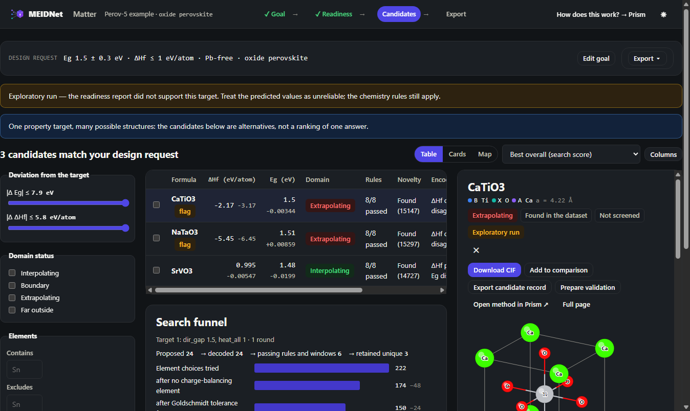

<p align="center"></p>

# MEIDNet Matter

**From your materials data to candidate structures.**

MEIDNet Matter is a multimodal inverse-design workbench for crystalline materials. A researcher brings crystal structures and properties; Matter reports what the data and the model support (the Design Readiness report), then runs a constrained, property-conditioned search and returns candidate structures with their evidence and provenance. The scientific engine is [MEIDNet](https://github.com/ABnano/MEIDNet), imported as a package; the sibling platform [MEIDNet Prism](https://babu09-meidnet.hf.space/) is where to learn the method, reproduce the results and benchmark models.

[](https://github.com/ABnano/MEIDNet-Matter/actions/workflows/ci.yml)
[](https://huggingface.co/spaces/Babu09/MEIDNet-Matter)
[](https://pypi.org/project/meidnet/)
[](LICENSE)
[](https://doi.org/10.1038/s41524-026-02153-3)

Matter currently searches property-conditioned candidates within supported structural families. Free-geometry crystal generation is planned as additional design backends mature.

## Try it

**Live:** https://babu09-meidnet-matter.hf.space/ — open the Perov-5 demo project, set a band-gap target, exclude lead, read the readiness report, run the search (about a minute on the shared CPU), open a candidate, download its CIF or the whole run bundle.

## What it does, in this version

| Step | What you get |
|---|---|
| **Goal** | Target value, range or bound per property; family and variant; excluded elements and presets; the chemistry rules with their limits; the search budget. |
| **Readiness** | Six indicators before any search: held-out prediction error of each targeted property, cross-modal retrieval in both directions, what the decoder recovers, where the target sits in the training distribution and how much data lies around it, how many structures share the target window, and whether the family's elements occur in the data. One verdict; a "not recommended" target can still be searched in exploratory mode. |
| **Candidates** | A search with the engine; every candidate carries its predicted values with their domain status, the rules with values and windows, the encoder's own prediction of the composition and whether it agrees with the search's, the nearest training materials with their DFT values, the training data around the prediction, whether the dataset already holds it, the stability stage, and a "why" sentence that repeats these facts. Table, cards and map; filters; comparison side by side. |
| **Export** | CIF per candidate, the candidate table, the candidate record, and the run bundle: goal, engine configuration, metrics, readiness, candidates, CIFs, a manifest with file hashes. |

The demo project: cubic ABX₃ perovskites of the Perov-5 dataset, the published MEIDNet model, the direct band gap and the formation enthalpy. By the engine's thresholds the published model is weak on both properties on held-out data, so the demo opens its searches in exploratory mode by design; [docs/scientific-scope.md](docs/scientific-scope.md) has the numbers and what the evidence shows instead.

Coming next (Phase 1): upload your own property table and CIF files, a data-quality report, training in the browser, readiness on your own held-out data, the same search with your model. [docs/data-format.md](docs/data-format.md) describes the layout.

## Run it yourself

```bash
git clone https://github.com/ABnano/MEIDNet-Matter && cd MEIDNet-Matter
pip install -e ".[dev]"                        # the engine (meidnet) comes from PyPI; CPU torch wheels are fine
python scripts/fetch_assets.py                 # the model file, with its checksum
cd frontend && npm ci && npm run build && cd ..
python -m uvicorn matter.app:app --port 8000   # http://127.0.0.1:8000/
```

Nothing leaves your computer. Details, the Docker image and the Space deploy: [docs/deployment.md](docs/deployment.md). What happens to your data on the shared Space: [docs/privacy.md](docs/privacy.md).

## How it works

Data → readiness → shared latent space → search → candidates. MEIDNet learns one latent space shared by crystal structures and their properties and searches it for compositions that hit property targets while obeying the chemistry rules of a material family; Matter adds the readiness report before the search, the evidence next to every candidate, the run manifest, and the interface. The backend (`matter/`, FastAPI) calls the `meidnet` package through one backend interface so that other design engines can be added; the frontend (`frontend/`, React + TypeScript) is built into `matter/static` and served by the backend.

## Development

```bash
python -m pytest -q                                          # backend; -m "not slow" skips the model and the tiny search
cd frontend && npm run typecheck && npm test && npm run lint  # frontend
node scripts/smoke_browser.mjs http://127.0.0.1:8000 build/smoke   # the browser walk-through against a running server
```

## Citation

If you use MEIDNet Matter, please cite the MEIDNet paper and the software ([CITATION.cff](CITATION.cff)):

> A. Babu, R. Almeida Gouvêa, P. Vandergheynst, G.-M. Rignanese, MEIDNet: Multimodal generative AI framework for inverse materials design, npj Computational Materials 12, 287 (2026). doi:10.1038/s41524-026-02153-3

Data: Perov-5 (Castelli et al. 2012) in the CDVAE split (Xie et al. 2022). Licence: MIT. Author: Anand Babu.
